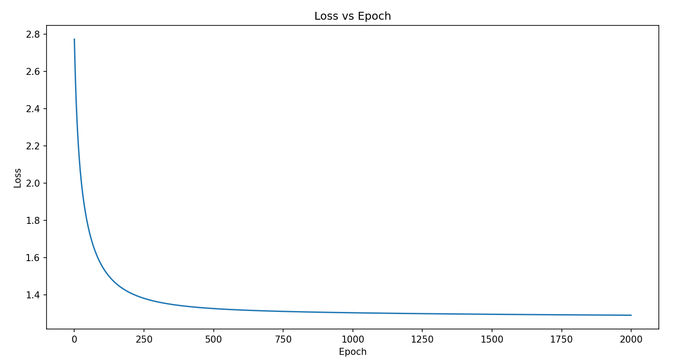
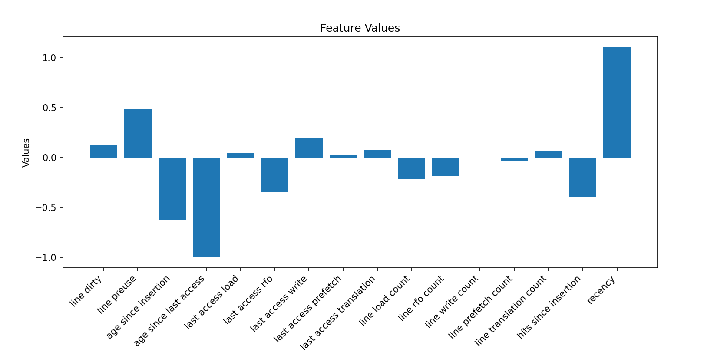
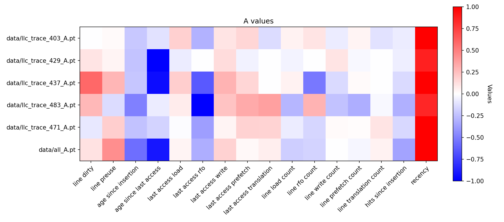
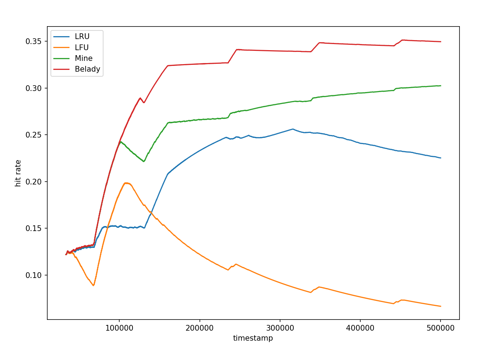
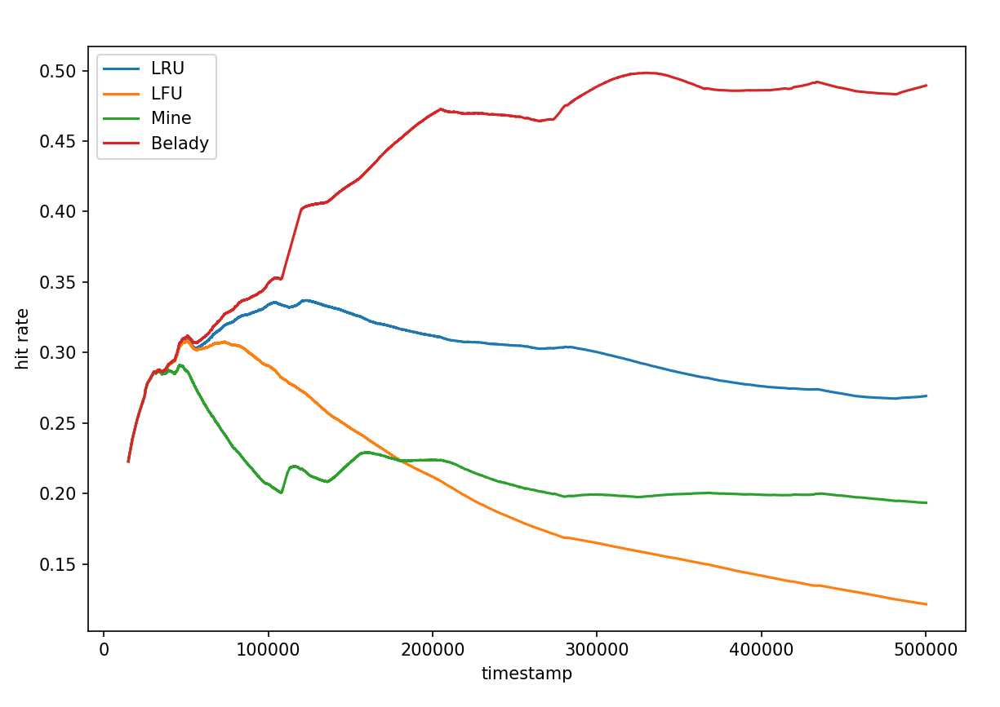

  <h1>Cache 相关问题探索总结报告</h1>
  <h4>2112052 郭大玮</h4>

## 问题描述

Cache 是计算机系统结构中的重要概念，而 Cache 替换策略的有效性直接影响了 Cache 的性能。前人的研究在使用强化学习方法寻找 Cache 替换策略进行了探索，但是其中的强化学习只起到了一个“提供灵感”的作用，还需要人工对其进行一定的总结和归纳，这其中就会引入许多主观因素，而且此前的研究往往对这个”人工介入“的部分没有进行详细的说明，强化学习得到的所谓”权重“可解释性也不强。因此，本次探索试图过直接训练得到一个权重向量来自动化地学习缓存特征和替换策略之间的关系，以此来克服现有强化学习方法的局限性，提高可解释性，减少人为总结所带来的主观因素。

## 相关工作

在缓存替换策略的研究领域，已有许多工作试图通过各种算法来优化缓存的性能。这些研究可以大致分为两类：
1. 基于经典算法的方法和基于学习的方法。经典算法如LRU、FIFO和LFU等，其实现简单而且效果较好，
2. 基于学习的方法，如强化学习、遗传算法等，这些方法可以通过学习来自动地优化缓存替换策略，但是其可解释性较差，往往需要人工对其进行总结和归纳。

本次探索的主要灵感来自论文 Designing a Cost-Effective Cache Replacement Policy using Machine Learning^[S. Sethumurugan, J. Yin and J. Sartori, "Designing a Cost-Effective Cache Replacement Policy using Machine Learning," 2021 IEEE International Symposium on High-Performance Computer Architecture (HPCA), Seoul, Korea (South), 2021, pp. 291-303, doi: 10.1109/HPCA51647.2021.00033.]。在论文中，作者利用强化学习方法在大量真实程序的 trace 中进行训练，以一些作者总结的与当前访问信息、Cache 组信息、Cache Line 信息相关的特征作为输入，以一个多层感知机作为智能体，选择特定的 Cache 块进行替换，与 理论最优（Baledy）相比较得到 reward，以此学习最佳的替换策略。
然而，由于 MLP 的计算量较大，无法在硬件上进行实现，因此作者选择观察分析该模型的权重和选择的特征，人工设计总结出了一种近似线性模型（易于硬件实现）的缓存替换策略。
但实际上，作者使用的强化学习方法只是起到了一个“提供灵感”的作用，而且其通过分析模型的“权重”来作为人工选取特征的方式可解释性也不强。由于 MLP 的特性，热图只能表示模型“关注了”这些特征，而不能解释这些特征具体的作用（如正相关，负相关），而且多层 MLP 的权重本身就很难解释，即使权重比较大，也不能说明其对应的特征对最终结果的影响有多大。
此外作者在论文中也没有对其“人工总结”的过程进行详细的说明，这也会引入许多主观因素，手动总结的过程免不了在验证集上进行手动调参，从而降低了严谨性和泛用性。

## 动机

分析上述论文中作者手动总结的过程发现，实际上强化学习只是起到了一个“为选取特征的有效性提供一个权重”的作用，然后人工按照模型的权重去分析（猜测）每个特征为什么有效，实际上总结出来的替换算法是一个新设计的近似线性模型（原文中给出的计算方法如下）：

$$P_{line} = 8 \cdot P_{age} + P_{type} + P_{hit}$$

其中：
 - Age priority：每个 Cache Line 有一个 Age counter，当 Age counter 达小于 RD 的值时，Age priority 为 1，否则为 0。
 - Type priority：当 Cache Line 的上一次访问类型不为 Prefetch 时，Type priority 为 1，否则为 0。
 - Hit priority：当 Cache Line 的命中过，则 Hit priority 为 1，否则为 0。

而像里面 8，1，1 这些 magic number 是怎么来的，文中并没有给出明确的解释。
既然最后总结出来的是个近似的线性模型，那我们不如就直接通过机器学习的方法来学习这个线性模型，这样可以避免人工调参的主观因素。

## 解决方案

可以将以上问题抽象为以下问题：
根据给定的 Cache line 相关 feature（来自论文中的特征）：

| line dirty         | line preuse        | age since insertion | age since last access |
|--------------------|--------------------|---------------------|-----------------------|
| last access load   | last access rfo    | last access write   | last access prefetch  |
| last access translation | line load count    | line rfo count       | line write count       |
| line prefetch count | line translation count | hits since insertion | recency              |

我们可以得到一个 $associativity \times feature\_num$ 的特征矩阵 $M$，我们的目标是找到特征的权重向量 $\mathbf{m}$ (长度为 $feature\_num$)，使得 
$$action=\argmax_i(M \cdot \mathbf{m})$$
得到的 $action$ 尽量接近于理论最优的替换策略（Baledy）。

为了学习 \( \mathbf{m} \)，我们使用梯度下降法。由于最大值函数是不可导的，我们使用 softmax 函数来近似最大值函数。softmax 函数将 \( M \cdot \mathbf{m} \) 的每个元素映射到一个概率分布上，即：

\[ \text{probabilities} = \frac{\exp(M \cdot \mathbf{m})}{\sum_j \exp(M_j \cdot \mathbf{m})} \]

然后，我们使用交叉熵损失函数（cross-entropy loss）作为目标函数，用于量化最优替换（由Belady给出）和模型分布之间的差异。交叉熵损失函数定义如下：

\[ \text{loss} = -\sum_i \left( \text{baledy}_i \cdot \log(\text{probabilities}_i) \right) \]

通过最小化这个损失函数，我们可以有效地调整 \( \mathbf{m} \)，从而使模型预测的动作尽可能接近实际的最优动作。

## 实验设置

**非常感谢 2111876 梅骏逸 同学做的前期工作，编写了 ChampSim trace 导出的代码和 Python Cache 模拟器的代码**^[https://github.com/JuniMay/cache-study]  
训练和测试数据集来自 3rd Data Prefetching Championship^[https://dpc3.compas.cs.stonybrook.edu/champsim-traces/speccpu/] 的真实程序 trace。
此处使用了梅骏逸同学提供的 ChampSim trace 导出代码和部分 trace 导出文件作为训练数据。
使用`403.gcc-48B` `429.mcf-217B` `437.leslie3d-273B` `483.xalancbmk-736B` `astar-23B` 提取 LLC 访问记录并且用于模型的训练过程。
ChampSim 的配置主要参考了论文中的配置
| Level  | Set Size | Ways | Latency (cycles) | Prefetcher       | Replacement Policy |
|--------|----------|------|------------------|------------------|--------------------|
| L1I    | 64       | 8    | 4                | next_line_instr  | lru                |
| L1D    | 64       | 8    | 4                | next_line        | lru                |
| L2C    | 512      | 8    | 12               | ip_stride        | lru                |
| LLC    | 2048     | 16   | 26               | no               | /      |

使用梅骏逸同学提供的 Python Cache 模拟器对相关 trace 的特征信息以及最优动作生成了训练数据集，使用 Pytorch 的梯度下降方法进行训练。
具体特征的选取与 Cache 模拟器的具体实现参见梅骏逸同学的实验报告。
## 实验结果

为了验证这一方法的可解释性与可行性，我们在几个 Trace 上进行了训练，由于是梯度下降（不是随机梯度下降），因此 loss 收敛非常稳定，如下图所示：

训练得到的权重向量 $\mathbf{m}$ 如下：

可以看到，得到的权重与论文中“人工选取”的特征非常一致。`line preuse` `age since insertion/last access` `hit since insertion` `recency` 都是权重绝对值较大的特征，而且权重的符号代表着这一特征是与替换的权重正相关还是负相关。
如：
 - `line preuse` 权重为正，表明 `line preuse` 越大，上两次访问同一 Cache Line 的时间间隔越大，可以预测下一次访问该 Cache Line 的时间间隔也会比较大，因此越应该被替换。
 - `age since insertion/last access` 权重为负，表明 `age since insertion/last access` 越小，说明该 Cache Line 访问越频繁，应该被保留（类似 LFU）。
 - `hit since insertion` 权重为负，表明 `hit since insertion` 越小，该 Cache Line 被使用的次数越少，应该被替换。
 - `recency` 权重为正，表明 `recency` 越大，该 Cache Line 被使用的时间越近，应该被保留（类似 LRU）。

此外分析 `last access type` 的四个权重，与论文中编码成一个值不同，我们采取了 one hot 编码，分析权重可以看到，`last access prefetch` 的权重几乎为 0，说明 prefetch 对替换策略的影响非常小，这可能对应着论文中的 `P_type` 为 0 的情况。

此外，`line preuse` 和 `age since insertion/last access` 对应着论文中的 `P_age`，`hit since insertion` 对应着论文中的 `P_hit`，`recency` 对应着论文中的 `P_type`。

根据上述分析，我们不仅重新验证了传统策略（如 LRU、LFU）的有效性，而且还重新发现了论文中作者人工总结的规律，并且解释了“人工选取”的特征为什么有效。

与原论文相同，我们也在不同的 Trace 上分别进行训练，得到不同的权重向量：

可以看到，在不同的 Trace 上，权重向量的分布大致相似，这说明我们得到的权重向量泛化性较好，总结的替换策略也具有一定的泛用性。但在不同的 Trace 上，权重向量的分布也有一定的差异，不同程序上的替换策略也有一定的差异，（这可以作为后续工作的方向）。

在模拟器上对得到的线性模型进行测试，**在训练集上**的测试结果如下：

其中x轴是指令数（instruction），y轴是缓存命中率（cache hit rate）。

可以看到，我们得到的线性模型超过了 LRU，选择上更接近与一种结合了 LRU 和 LFU 以及一些其他特征的混合替换策略。

*(实际上这是最好的一个测试 Trace，其他 Trace 上的测试结果没有这么好当时没保存，时间有限，没有进行更多的测试，后续期末那次会补充上更多的测试结果)*

但是在**域外测试集**上的测试结果就比较差了，如下图所示：

严重怀疑是训练集太小，过拟合严重。之后会尝试更多的 Trace 进行训练，以及更多的测试。

## 后续研究计划

**写报告的时候发现，现在的 Python Cache 模拟器有一些 bug，复现论文中的一些特征不太对（还在测试中），以上训练出的结果可能有所偏差，之后会修复这些 bug**，此外由于导出 Trace 所需的时间较长，现有训练集的规模太小，之后会加大训练集的规模，以及进行更多的测试。

此外在研究过程中还发现，可以使用强化学习/线性模型等对现有的替换算法进行选择（例如根据情况选择 LRU 或者 LFU），或者将其作为特征混入线性模型进行选择

此外可以将 Prefetch 纳入考虑，使用 Rethinking Belady's Algorithm to Accommodate Prefetching^[A. Jain and C. Lin, "Rethinking Belady's Algorithm to Accommodate Prefetching," 2018 ACM/IEEE 45th Annual International Symposium on Computer Architecture (ISCA), Los Angeles, CA, USA, 2018, pp. 110-123, doi: 10.1109/ISCA.2018.00020.] 中提到的 Demand-MIN 来代替上述的 Belady 算法，以此来考虑 Prefetch 对替换策略的影响。

## 结论

通过以上实验发现，一个简单的线性模型通过梯度下降方法优化，就可以代替“强化学习”模型，学习到可解释性强，无需人工总结的替换策略，这种监督学习方法效率更高，可解释性更强，可扩展性也更好。但其实用性和泛用性仍需要进一步研究和测试。